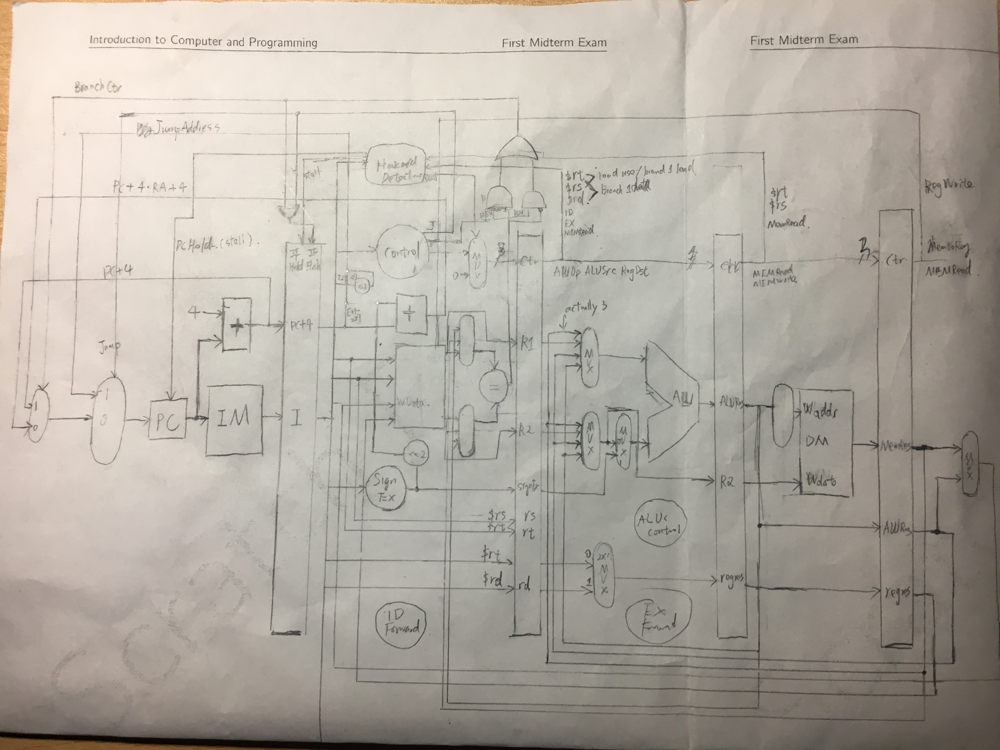

# MIPS 5 Stage Pipeline

Course project 2 for VE370 Introductiont to Computer Organization, instructed by Gang Zheng. This is a xilinx project bundle which is synthesized on xilinx ise 10.1 and xilinx nexys 2 fpga board.

## Usage

Edit the ```initial begin``` ... ```end``` block in ```IM.v``` to change the test instructions.

The ```display.v``` offers a switch controlled cycle simulation on board as well as a switch for mode. One mode for instruction checking and the other one for reg value checking. You can define the corresponding key/switch according to your fpga board.

## Feature

Basically implemented:
* The memory-reference instructions load word (lw) and store word (sw)
* The arithmetic-logical instructions add, addi, sub, and, andi, or, and slt
* The jumping instructions branch equal (beq), branch not equal (bne), and jump (j)

Some hazards handled by forwarding units (refer to ```EXForward.v``` and ```IDForward.v```):
* one-level data hazard
* two-level data hazard
* two-level load use hazard (exclude branch cases)
* two-level branch data hazard
* three-level branch load hazard

Some other hazards handled by stall and transferred to hazards listed above (refer to HazardDetector.v):
* one-level load use hazard -> two-level load use hazard
* one-level branch data hazard -> two-level branch data hazard
* two-level branch load hazard -> three-level branch load hazard
* one-level branch load hazard -> two-level branch load hazard

## Design

